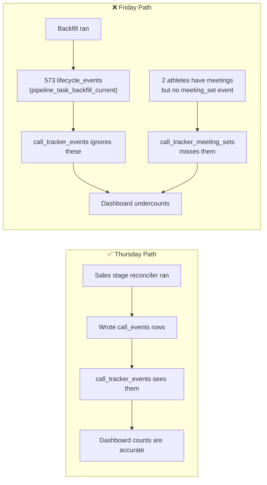
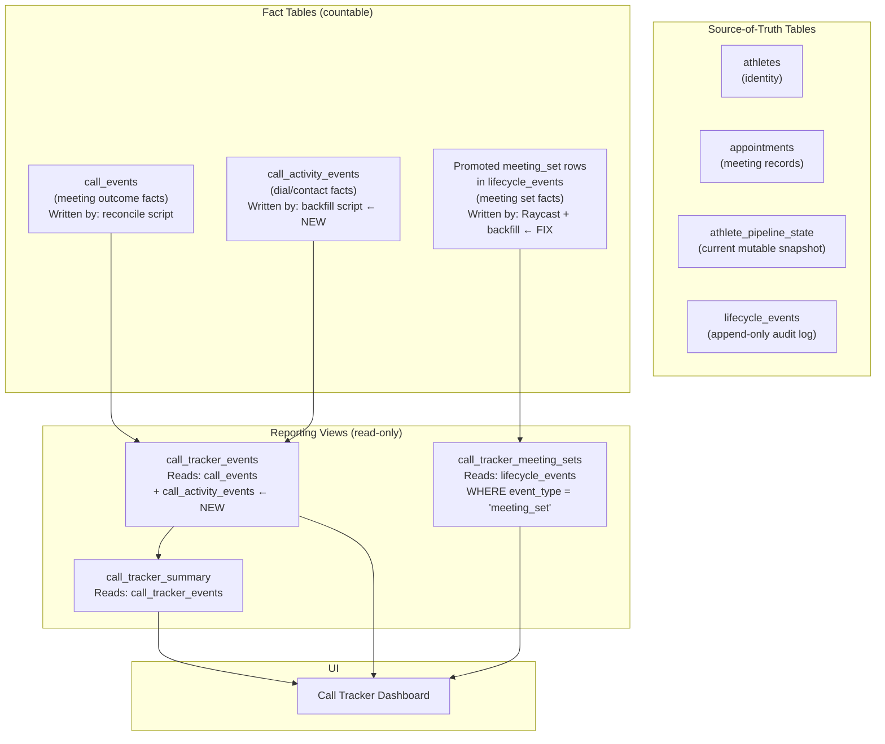

# Call Tracker Data Model — Diagnosis & Refactor Plan

---

## 1. Current Data Model Map

### Source Tables (things scripts write to directly)

| Table | What It Stores | Kind | Written By | Read By |
|---|---|---|---|---|
| **athletes** | Identity: who is this athlete? One row per `athlete_key` (`athleteId:athleteMainId`). Name, IDs. | Identity (source of truth) | All 3 sync scripts + `supabase-lifecycle.ts` (Raycast actions) | Joined by views; `reconcile-booked-meetings` reads it for name lookup |
| **athlete_pipeline_state** | Current snapshot: what CRM stage, task, and appointment is active *right now* for each athlete. One row per athlete, upserted on every sync. | Current state (mutable snapshot) | All 3 sync scripts + `supabase-lifecycle.ts` | `reconcile-current-sales-stages` reads it as input to iterate over active athletes |
| **appointments** | Booked meeting records: event ID, start time, status, head scout. One row per meeting. | Appointment state | `backfill-current-pipeline`, `reconcile-booked-meetings`, `reconcile-current-sales-stages`, `supabase-lifecycle.ts` | Joined by `call_tracker_events` view (for `event_at`); `supabase-lifecycle.ts` queries it |
| **lifecycle_events** | Audit/history log: every observation a sync script makes, one append-only row per observation. NOT a countable activity log. | Audit history (append-only) | All 3 sync scripts + `supabase-lifecycle.ts` | `call_tracker_meeting_sets` view reads rows where `event_type = 'meeting_set'` |
| **call_events** | **Tracker event facts**: each row is a deliberately counted action (dial, contact, meeting outcome). Has `dedupe_key` to prevent double-counting. | Event fact (append-only, deduped) | **Only** `reconcile-current-sales-stages` + `repair-call-event-owner-proof` | `call_tracker_events` view (the main reporting surface) |
| **call_activity_events** | Per-task call activity facts (task_id as unique key). Intended for granular dial/contact tracking. | Event fact (append-only, deduped by task_id) | **Nothing currently writes to it** (table exists but is unused) | **Nothing currently reads it** |
| **reminders** | Confirmation call / follow-up reminder scheduling. | Reminder state | `supabase-lifecycle.ts` | `supabase-lifecycle.ts` health check |

### Derived Views (read-only reporting surfaces)

| View | What It Shows | Reads From | Read By |
|---|---|---|---|
| **call_tracker_events** | Deduped, owner-filtered, outcome-classified tracker rows. The main reporting table the UI reads for the events list. Complex 4-CTE pipeline: `classified → trusted → ranked → final`. | `call_events` + left join to `appointments` | Call Tracker UI (`app.js`) |
| **call_tracker_meeting_sets** | Meeting-set rows from lifecycle history. Supplements `call_tracker_events` (which filters out `meeting_set` from `call_events`). | `lifecycle_events` where `event_type = 'meeting_set'` + join to `athletes` | Call Tracker UI (`app.js`) |
| **call_tracker_summary** | Top-line dashboard totals (total events, spoke, voicemail, closed won, revenue, etc.). | `call_tracker_events` | Call Tracker UI (`app.js`) |

---

## 2. How the Sync Pipeline Runs

```mermaid
flowchart TD
  A["Refresh Button\n(Call Tracker UI)"] --> B["Prospect Web /api/call-tracker-sync"]
  B --> C["Tailscale Funnel → FastAPI"]
  C --> D["POST /api/v1/call-tracker/sync"]
  D --> E["bash scripts/sync-supabase-pipeline.sh"]

  E --> F["Step 1: backfill-current-pipeline-to-supabase.mjs"]
  E --> G["Step 2: sync-booked-meetings-to-supabase.mjs"]
  E --> H["Step 3: reconcile-current-sales-stages-to-supabase.mjs"]

  F -->|writes| I["athletes\nappointments\nathlete_pipeline_state\nlifecycle_events"]
  F -->|event_type| J["pipeline_task_backfill_current"]

  G -->|writes| K["athletes\nappointments\nathlete_pipeline_state\nlifecycle_events"]
  G -->|event_type| L["booked_meeting_gap_reconciled"]

  H -->|writes| M["athlete_pipeline_state patches/deletes\nappointments patches\nlifecycle_events\ncall_events ✅"]
  H -->|event_type| N["sales_stage_reconciled"]
  H -->|source| O["legacy_sales_stage_current"]

  style M fill:#1a4d2e,stroke:#2d8b4e
  style H fill:#1a3d5c,stroke:#3498db
```



> [!IMPORTANT]
> **Only Step 3** (`reconcile-current-sales-stages`) writes to `call_events`. Steps 1 and 2 write *only* to `lifecycle_events`, which is an audit log — not a fact table.

---

## 3. Why Thursday Works and Friday Doesn't

### Thursday (Apr 30) — Accurate

Thursday's data followed this path:

1. `backfill-current-pipeline` ran, creating `lifecycle_events` rows with `event_type = 'pipeline_task_backfill_current'` and writing `athlete_pipeline_state` rows.
2. `reconcile-booked-meetings` ran, creating `lifecycle_events` rows with `event_type = 'booked_meeting_gap_reconciled'`.
3. **`reconcile-current-sales-stages` ran**, iterating over `athlete_pipeline_state` rows. For each athlete with an ended booked meeting, it:
   - Computed the CRM stage from the live selected sales stage and the booked event title prefix
   - **Wrote a `call_events` row** with `source = 'legacy_sales_stage_current'` and a `dedupe_key`
   - Wrote a `lifecycle_events` row with `event_type = 'sales_stage_reconciled'`

Result: `call_events` has **34 rows** for Thursday → `call_tracker_events` view shows 34 → dashboard reports 25 calls, 7 contacts, 2 set meetings. ✅

### Friday (May 1) — Broken

Friday's data stopped at Step 1:

1. `backfill-current-pipeline` ran, creating **573 `lifecycle_events` rows** with `event_type = 'pipeline_task_backfill_current'`.
2. `reconcile-booked-meetings` ran, creating a few `lifecycle_events` rows.
3. **`reconcile-current-sales-stages` ran but found few/no athletes with ended booked meetings** (it's still Friday — meetings haven't ended yet, or the reconciliation logic didn't match).

Result: `call_events` has **only 11 rows** for Friday → `call_tracker_events` view shows 11 → dashboard shows only 4 calls.

> [!CAUTION]
> **The 573 `lifecycle_events` rows for Friday are `pipeline_task_backfill_current` snapshots. They are NOT call activity facts.** They represent "what task is this athlete currently on?" — like a live scoreboard. They should **never** be counted as dials/contacts.

### The Meeting Set Gap

`call_tracker_meeting_sets` reads from `lifecycle_events WHERE event_type = 'meeting_set'`.

- For Friday, only **4 athletes** have explicit `event_type = 'meeting_set'` lifecycle rows: Aiden Murray, Aiden Williams, Dre'kel Clayton, Tyric Smith.
- **Bryce Hill and Ancel Bynaum Jr** have evidence of meetings in their `pipeline_task_backfill_current` payload (the `current_meeting` and `current_appointment_id` fields are populated), but no one ever wrote a `meeting_set` lifecycle event for them.

This means:
- Their meetings were likely set via a direct action (not through a Raycast command that calls `supabase-lifecycle.ts writeMeetingSet`)
- The backfill script *saw* the meeting but only recorded it as a snapshot, not as a `meeting_set` event

---

## 4. Root Cause Summary



**Three distinct problems:**

| # | Problem | Why It Happens |
|---|---|---|
| 1 | **Friday dials/contacts are undercounted** | `reconcile-current-sales-stages` only writes `call_events` when it detects a *reconcilable change* (an ended booked meeting with an outcome). On a live workday, most meetings haven't ended yet, so there's nothing to reconcile. The actual *calling activity* (leaving VMs, speaking to contacts) is never explicitly written as a fact. |
| 2 | **2 meeting sets are missing** | Bryce Hill and Ancel Bynaum Jr's meetings were set outside of a Raycast workflow that calls `writeMeetingSet()`. The backfill sees the meeting but only records it as a snapshot, not as a `meeting_set` lifecycle event. |
| 3 | **No script writes dial/contact facts in real time** | `call_activity_events` table exists (migration `010`) with the right schema, but **nothing writes to it**. It was designed for this purpose but never connected. |

---

## 5. Proposed Refactor

### Design Principles

1. **Facts ≠ Snapshots**: Call activity facts must be explicitly written, not inferred from pipeline snapshots.
2. **One canonical fact table per concern**: `call_events` for reconciled meeting outcomes, `call_activity_events` for dial/contact activity.
3. **Views read only from fact tables**: `call_tracker_events` and `call_tracker_meeting_sets` should only read canonical facts.
4. **Snapshots stay as audit**: `lifecycle_events` remains append-only audit history. `athlete_pipeline_state` remains the mutable current-state snapshot.

### Proposed Architecture



### Concrete Changes

#### Change 1: Backfill Script Writes `call_activity_events`

`backfill-current-pipeline-to-supabase.mjs` currently only writes `lifecycle_events` (snapshot rows). It should also write to `call_activity_events` for each pipeline task that represents a real action:

- A task with `task_status = 'call_attempt_1'` or `'call_attempt_2'` or `'call_attempt_3'` = a dial
- A task with `task_status = 'spoke_to_follow_up'` = a contact

The `call_activity_events` table already has the right schema: `task_id` (unique), `activity_type`, `occurred_at`, `source_owner`, `owner_proof`. The unique index on `task_id` prevents double-counting across multiple sync runs.

#### Change 2: Backfill Script Promotes Missing Meeting Sets

When `backfill-current-pipeline-to-supabase.mjs` sees an athlete with `current_meeting` evidence but no existing `meeting_set` lifecycle event, it should insert a `lifecycle_events` row with `event_type = 'meeting_set'`.

This is a **deliberate promotion** — the script verifies the meeting exists in the live calendar, then writes a fact row.

#### Change 3: `call_tracker_events` View Unions Activity Facts

The `call_tracker_events` view should be updated to `UNION ALL` rows from both `call_events` (meeting outcomes) and `call_activity_events` (dials/contacts):

```sql
-- Simplified concept:
CREATE OR REPLACE VIEW call_tracker_events AS
  -- Existing meeting-outcome facts from call_events
  (SELECT ... FROM call_events WHERE ...)
  UNION ALL
  -- Daily dial/contact facts from call_activity_events
  (SELECT ... FROM call_activity_events WHERE ...);
```

#### Change 4: Summary View Adds Daily Activity Counters

The `call_tracker_summary` view should add columns for `dials` and `contacts` that count from the `call_activity_events` portion of the unified view.

### What Stays the Same

- `athlete_pipeline_state` remains the mutable current-state snapshot — no changes.
- `lifecycle_events` remains the audit trail — no changes to its structure.
- The sync pipeline order (backfill → reconcile meetings → reconcile stages) remains the same.
- The Refresh button → Prospect Web → FastAPI → bash pipeline remains the same.
- Thursday's numbers remain accurate (the `call_events` rows from the reconcile script are unchanged).

---

## 6. Test & Verification Plan

| # | Test | Expected Result |
|---|---|---|
| 1 | Run sync on a Thursday-like day where meetings have ended | `call_events` rows still written by reconcile script. Thursday numbers unchanged. |
| 2 | Run sync on a Friday-like day (live workday) | `call_activity_events` rows written by backfill script. Dashboard shows dial/contact counts matching real activity. |
| 3 | Manually set a meeting outside Raycast (e.g., directly in NPID) then sync | Backfill script detects the meeting and writes a `meeting_set` lifecycle event. `call_tracker_meeting_sets` shows it. |
| 4 | Run sync twice on the same data | `call_activity_events` dedupes on `task_id`. No double-counting. `call_events` dedupes on `dedupe_key`. No inflation. |
| 5 | Check that Bryce Hill and Ancel Bynaum Jr appear in meeting sets after fix | Both should appear in `call_tracker_meeting_sets` after the backfill promotion logic runs. |
| 6 | Verify `pipeline_task_backfill_current` rows never appear in tracker | `call_tracker_events` view only reads from `call_events` + `call_activity_events`, never from `lifecycle_events` (except via `call_tracker_meeting_sets`). |

---

## 7. Files to Modify

| File | Change |
|---|---|
| [backfill-current-pipeline-to-supabase.mjs](file:///Users/singleton23/Raycast/prospect-pipeline/scripts/backfill-current-pipeline-to-supabase.mjs) | Add `call_activity_events` writes for dial/contact tasks. Add `meeting_set` lifecycle event promotion for athletes with meeting evidence but no existing event. |
| [call_tracker_events view](file:///Users/singleton23/Raycast/prospect-pipeline/supabase/migrations/20260501012000_call_tracker_suppress_changed_event_ids.sql) | New migration to `UNION ALL` `call_activity_events` into the view. |
| [call_tracker_summary view](file:///Users/singleton23/Raycast/prospect-pipeline/supabase/migrations/20260501012000_call_tracker_suppress_changed_event_ids.sql) | Add `dials` and `contacts` counters. |
| [app.js](file:///Users/singleton23/Raycast/prospect-pipeline/apps/prospect-web/public/prospect-call-tracker/app.js) | Update `isDailyCallActivity` and `isDailyContact` to recognize activity events. |

> [!NOTE]
> No changes to `reconcile-current-sales-stages-to-supabase.mjs`, `sync-booked-meetings-to-supabase.mjs`, `call_tracker.py`, `call-tracker-sync.mjs`, or `supabase-lifecycle.ts`. The fix is upstream (backfill writes real facts) and downstream (views read from the right tables).
