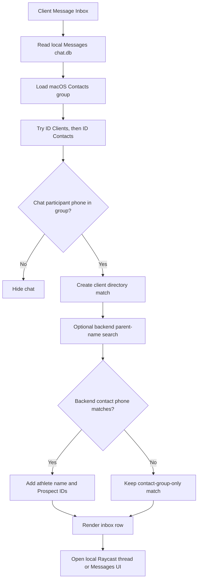
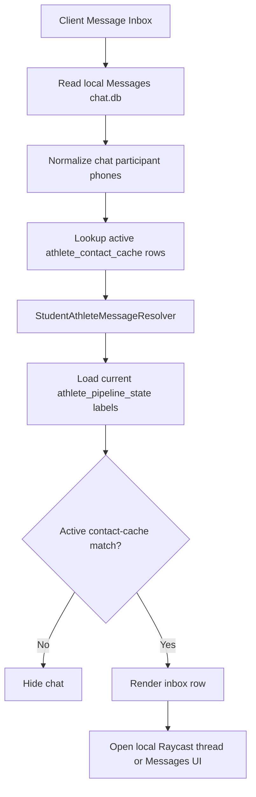
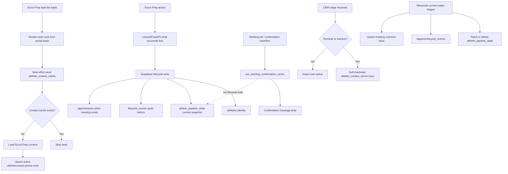
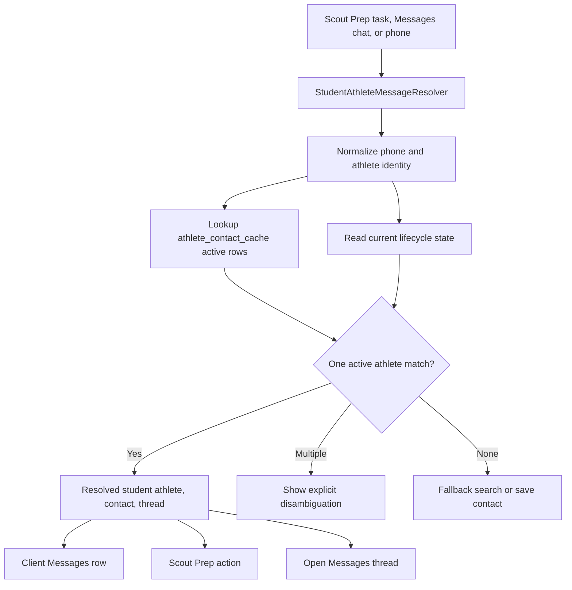

# Scout Prep Client Message And Lifecycle Flowcharts

This note shows the message resolver path and the lifecycle/cache boundaries. The goal is less moving parts, not less rigor: keep Scout Prep, Client Messages, lifecycle, and caches tied to the same domain truth.

## Legacy Client Messages Routing

Legacy behavior: the contact group was the gate. Athlete identity was enrichment after a phone was already admitted by `ID Clients` or `ID Contacts`.

Group threads are resolved by matched participant phone. If a parent and student athlete both appear across threads, that legacy path did not have a single student-athlete resolver in the middle.

## Implemented Client Messages Routing

Current behavior: active `athlete_contact_cache` rows admit a thread into Client Messages. macOS contact groups are not the filter.

## Current Lifecycle And Cache Truth

Current behavior: lifecycle truth and message lookup are related but not centralized. `athlete_pipeline_state` can be deleted when a row leaves the active working set. `athlete_contact_cache` is soft-inactivated by lifecycle stage. Confirmation cache remains a message-prep cache and should not decide whether someone is in the lifecycle.

## Target Resolver Shape

Current behavior: `athlete_contact_cache` plus lifecycle state is the gate. Other caches do not decide whether a client message belongs in the workflow.

## Remaining Gaps

- Ambiguous message matches are flagged for review, but the UI does not yet provide a dedicated chooser.
- Cleanup is split: lifecycle state can be deleted, contact cache is soft-inactivated, confirmation cache persists as message support, and audit/history rows remain append-only.
- Group-message opening is less deterministic than one-to-one Messages opening because the current link is built from participant addresses.
