# Scouting Coordinator System Map

This document is the repo-owned map for Scout Prep, Client Messages, Set Meetings, Scout Openings, lifecycle, contacts, and reporting work. Use it before adding new commands, helpers, scripts, Supabase writes, or Laravel/API calls.

The operating rule:

> Commands are buttons. Buckets are jobs. Domains own meaning. Supabase stores durable truth. Laravel/API calls fetch or mutate source systems. Helpers move data through the right bucket.

## Buckets

| Bucket | Owns | Does not own |
| --- | --- | --- |
| Meetings | Appointment truth, booked meeting details, head scout openings, reschedules, confirmations, meeting timezone | Contact identity, post-meeting outcome meaning |
| Pre-Meeting Tasks | Call attempts, reminders, confirmation tasks, voicemail tasks, task-title completion gates before the meeting | CRM stage meaning, post-meeting results |
| Client Communication | Outbound messages, voicemail follow-ups, confirmations, Client Messages, recipient selection, message context | Durable meeting truth, lifecycle reporting counts |
| Lifecycle & Stage Truth | CRM sales stage, task status, lifecycle current/timeline, active/inactive states, source-owned reporting facts | Task IDs as stage meaning, UI-only display state |
| Enrollments & Outcomes | Close-won, close-lost, no-show, follow-up results, pending-client review, post-meeting outcomes | Pre-meeting task completion |
| Admin Data & Contacts | Athlete identity, contact cache, admin URLs, macOS Contacts, notes, phone facts, command-specific lookup tables | Meeting timezone ownership, lifecycle truth |

## One-System Visual

```mermaid
flowchart TD
  SC["Scouting Coordinator"]

  SC --> M["1. Meetings"]
  SC --> P["2. Pre-Meeting Tasks"]
  SC --> C["3. Client Communication"]
  SC --> L["4. Lifecycle & Stage Truth"]
  SC --> E["5. Enrollments & Outcomes"]
  SC --> A["6. Admin Data & Contacts"]

  SC --> CMD["Front-Facing Raycast Commands"]
  CMD --> SP["Scout Prep"]
  CMD --> CM["Client Messages"]
  CMD --> SO["Scout Openings"]
  CMD --> SM["Set Meetings"]
  CMD --> PS["Prospect Search"]
  CMD --> CI["Code Index / Admin Tools"]

  SP --> SP_MAIN["Scout Prep Main Action Panel"]
  SP_MAIN --> SP_BUILD["Build Scout Prep"]
  SP_MAIN --> SP_VM["Voicemail Follow-Up"]
  SP_MAIN --> SP_POST["Post-Call Update"]
  SP_MAIN --> SP_BATCH["Batch Operations"]
  SP_MAIN --> SP_FU["Follow-Ups"]
  SP_MAIN --> SP_INFO["Athlete Info"]
  SP_MAIN --> SP_NOTES["Athlete Note"]
  SP_MAIN --> SP_NAV["Navigation / Sort"]

  M --> M_CMD["Commands: Scout Prep, Scout Openings, Set Meetings"]
  M_CMD --> M_ACTIONS["Actions: Head Scout Schedules, choose slot, Open Meeting, reschedule, confirmation timing"]
  M_ACTIONS --> M_DOMAIN["Domains: appointment truth, booked meeting details, head scout openings, reschedule slots"]
  M_DOMAIN --> M_SUPA["Supabase: appointments, active_athlete_meeting_truth"]
  M_DOMAIN --> M_HELPERS["Helpers: booked-meeting-details-resolver, head-scout-schedules, appointment lifecycle"]
  M_HELPERS --> M_API["Laravel/API: calendar bookings, booked meeting details, admin athlete appointment tabs"]
  SP_INFO --> M_ACTIONS
  SO --> M_ACTIONS
  SM --> M_ACTIONS

  P --> P_CMD["Commands: Scout Prep"]
  P_CMD --> P_ACTIONS["Actions: Create Call Reminder, Create Text Reminder, Complete Task, Update Task, Move CF Task"]
  P_ACTIONS --> P_FORMS["Forms: Task Title, Description, Task Due Date, Set Scheduled Follow-Up"]
  P_ACTIONS --> P_DOMAIN["Domains: scout task selection, call attempts, reminders, task-title completion gates"]
  P_DOMAIN --> P_SUPA["Supabase: lifecycle_events, call activity facts"]
  P_DOMAIN --> P_HELPERS["Helpers: scout-task-selection, scout-follow-up-queue, reminder builders"]
  P_HELPERS --> P_API["Laravel/API: task fetch, task update, task complete"]
  SP_MAIN --> P_ACTIONS
  SP_FU --> P_ACTIONS

  C --> C_CMD["Commands: Client Messages, Scout Prep, Set Meetings"]
  C_CMD --> C_ACTIONS["Actions: Open Client Messages, Send Message, Voicemail Follow-Up, Personal Follow-Ups"]
  C_ACTIONS --> C_RECIP["Recipient Surfaces: Student Athlete, Parent 1, Parent 2, contact search"]
  C_ACTIONS --> C_DOMAIN["Domains: recipient selection, message context, voicemail copy, confirmation copy"]
  C_DOMAIN --> C_SUPA["Supabase: set_meeting_confirmation_cache, athlete_contact_cache reads"]
  C_DOMAIN --> C_HELPERS["Helpers: scout-message-context, scout-contact-selection, scout-follow-up-templates"]
  C_HELPERS --> C_API["Laravel/API: messages, contact phones, confirmation support"]
  SP_VM --> C_ACTIONS
  SP_FU --> C_ACTIONS
  CM --> C_ACTIONS

  L --> L_CMD["Commands: Scout Prep, Set Meetings, reporting views"]
  L_CMD --> L_ACTIONS["Actions: Post-Call Update, Save, Sync Notion Call Prep, Refresh Scout Prep"]
  L_ACTIONS --> L_STAGE["Stage Form: Official Sales Stage"]
  L_ACTIONS --> L_DOMAIN["Domains: CRM sales stage, task status, lifecycle current/timeline, reporting facts"]
  L_DOMAIN --> L_SUPA["Supabase: athlete_lifecycle_timeline, athlete_lifecycle_current, call tracker views"]
  L_DOMAIN --> L_HELPERS["Helpers: sales-lifecycle, supabase-lifecycle, supabase-lifecycle-translator"]
  L_HELPERS --> L_API["Laravel/API: sales stage update, pipeline state, task source data"]
  SP_POST --> L_ACTIONS

  E --> E_CMD["Commands: Scout Prep, Set Meetings, Pending Client review"]
  E_CMD --> E_ACTIONS["Actions: Close Won, Close Lost, No Show, Follow Up, Reschedule Pending"]
  E_ACTIONS --> E_RSP["Reschedule Pending Fields: RSP And Scout Notes, Note Title, Why They Rescheduled"]
  E_ACTIONS --> E_DOMAIN["Domains: post-meeting outcomes, pending client, enrollment result, reschedule pending"]
  E_DOMAIN --> E_SUPA["Supabase: meeting_events, pending_client_watchlist"]
  E_DOMAIN --> E_HELPERS["Helpers: post-call-action, pending-client-watchlist, outcome translators"]
  E_HELPERS --> E_API["Laravel/API: sales stage, Notes tab, commission/outcome evidence"]
  SP_POST --> E_ACTIONS

  A --> A_CMD["Commands: Scout Prep, Client Messages, Prospect Search"]
  A_CMD --> A_ACTIONS["Actions: Contact Info, Create All Contacts, Refresh Contact Info, Open Admin Page, Open Task Tab"]
  A_ACTIONS --> A_CONTACTS["Contact Detail Actions: Copy Parent 1 Phone, Copy Student Athlete Phone, Copy Parent 2 Phone"]
  A_ACTIONS --> A_ADMIN["Admin Actions: Open Contact Info on Admin, Open Athlete Admin Page, Open Athlete Task Tab, Open Player ID"]
  A_ACTIONS --> A_NOTES["Notes Actions: View Notes, Add Note, write contact notes, save admin URL"]
  A_ACTIONS --> A_DOMAIN["Domains: athlete identity, admin URL, contact cache, macOS Contacts, MaxPreps context"]
  A_DOMAIN --> A_SUPA["Supabase: athletes, athlete_contact_cache"]
  A_DOMAIN --> A_HELPERS["Helpers: contact cache plan, admin URL builder, athlete resolver, duplicate profile check"]
  A_HELPERS --> A_API["Laravel/API: athlete resolve, contact IDs, admin athlete page, Notes tab"]
  SP_INFO --> A_ACTIONS
  SP_NOTES --> A_NOTES
  PS --> A_ACTIONS

  SP_NAV --> NAV1["Show Today/PastDue"]
  SP_NAV --> NAV2["Show Tomorrow"]
  SP_NAV --> NAV3["Show Future"]
  SP_NAV --> NAV4["Show All"]
  SP_NAV --> NAV5["Prospect Search"]
  SP_NAV --> NAV6["Sort by Grad Year"]
  SP_NAV --> NAV7["Sort by Call Attempt"]
  SP_NAV --> NAV8["Daily Call Blocks"]
  SP_NAV --> NAV9["Duplicate Profile Check"]

  SC --> RULES["System Rules"]
  RULES --> R1["Start with the bucket before adding code."]
  RULES --> R2["Commands are buttons, not business truth."]
  RULES --> R3["Domains own meaning."]
  RULES --> R4["Supabase stores durable truth."]
  RULES --> R5["Laravel/API calls fetch or mutate source systems."]
  RULES --> R6["Helpers should serve a bucket, not become a new bucket."]
  RULES --> R7["No one-off scripts unless it is repair/audit and named that way."]
  RULES --> R8["Meeting time, timezone, scout, slots: Meetings bucket."]
  RULES --> R9["Call attempts, reminders, task completion: Pre-Meeting Tasks bucket."]
  RULES --> R10["Text, voicemail, recipients, message copy: Client Communication bucket."]
  RULES --> R11["CRM stage, task status, reporting: Lifecycle & Stage Truth bucket."]
  RULES --> R12["Close won/lost, no-show, follow-up result: Enrollments & Outcomes bucket."]
  RULES --> R13["Identity, admin URL, contacts, notes: Admin Data & Contacts bucket."]
```

## Placement Rules

Use these rules before adding or moving code:

- If the issue mentions meeting time, timezone, head scout, slot, booked meeting, confirmation timing, or reschedule slot, start in Meetings.
- If the issue mentions call attempts, reminders, task completion, scheduled follow-up, or confirmation task completion, start in Pre-Meeting Tasks.
- If the issue mentions texts, voicemail, recipients, message copy, Client Messages, or parent/student selection, start in Client Communication.
- If the issue mentions CRM stage, task status, lifecycle, active state, reporting counts, or Call Tracker, start in Lifecycle & Stage Truth.
- If the issue mentions close won, close lost, no-show, pending client, follow-up result, or post-meeting outcome, start in Enrollments & Outcomes.
- If the issue mentions athlete identity, contact cache, admin URL, macOS Contacts, notes, phone facts, Prospect Search, or MaxPreps context, start in Admin Data & Contacts.

## Source-Of-Truth Rules

- `appointments` and `active_athlete_meeting_truth` own durable meeting truth when appointment fields are present.
- `athlete_lifecycle_timeline` and `athlete_lifecycle_current` own lifecycle interpretation.
- `meeting_events` owns post-meeting outcome facts.
- `athlete_contact_cache` supports contact lookup and Client Messages admission; it does not own meeting truth.
- `set_meeting_confirmation_cache` supports confirmation/message workflows; it does not own lifecycle truth.
- Laravel/FastAPI endpoints are source-system adapters. Do not encode business meaning in endpoint wrappers when a domain helper already owns it.

## Repair And Audit Scripts

Repair scripts are allowed only when the task is explicitly repair/audit/backfill work. They must be named for repair/audit behavior and should not become the primary writer.

Before adding a script, check whether an existing domain writer or Supabase view should own the behavior instead.

## Skill Evolution Rule

The Codex skill should stay small. This document owns the map. Add to the skill only when an agent repeatedly fails a repo boundary. Add to this document when the business system becomes clearer.

## Pre-Edit Guard, Retrieval, And Context

This map is a pre-edit guard. It must be consulted before code edits in Scout Prep, Client Messages, Set Meetings, Scout Openings, lifecycle, contacts, reporting, Supabase, or adjacent scripts.

Use this distinction:

| Mechanism | What it is | Best use in this repo |
| --- | --- | --- |
| Skill | A reusable agent operating contract | "How Codex should think and work in Prospect Pipeline" |
| Architecture doc | Repo-owned source map | "Where does this work belong?" |
| Retrieval/reference | Context loaded only when needed | Specific docs, schemas, maps, examples, prior decisions |
| Pre-edit guard | Required check before editing | Classify the SC bucket and read this map before changing files |
| Script | Deterministic operation | Repair, audit, export, sync, or verification |
| Test/eval | Repeatable proof | Prevent boundary regressions |

In this Codex setup, the reliable before-edit mechanism is the repo contract plus skill instruction. Git hooks are after-edit/pre-commit tools, so they are not the right fit for this map.

Required pre-edit behavior:

- Before editing relevant files, classify the SC bucket.
- Read this map before creating new helpers, scripts, Supabase writes, or Laravel/API wrappers.
- If Supabase truth is touched, also read `docs/architecture/scout-prep-supabase-source-of-truth.md`.
- If a change creates a new domain helper or script, decide whether the system map needs a small update.
- Never auto-run write repairs from a guard. Repair work must be explicitly requested.

Do not use tooling to hide unclear ownership. If nobody knows where something belongs, fix the map or domain boundary first.
